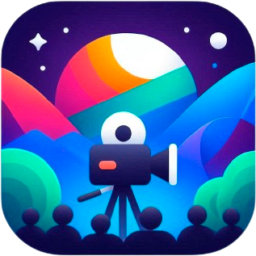

  

   
  

  <h1 align="center">
    <b>Casto</b>
  </h1>
  

    Streaming software accessible to all.
     
    <a href="https://casto.app">
      <b>casto.app</b>
    </a>
     
  

Casto is an open source cross-platform live production/streaming software powered by Electron and Vuetify.
 
 

  
  
  
   

